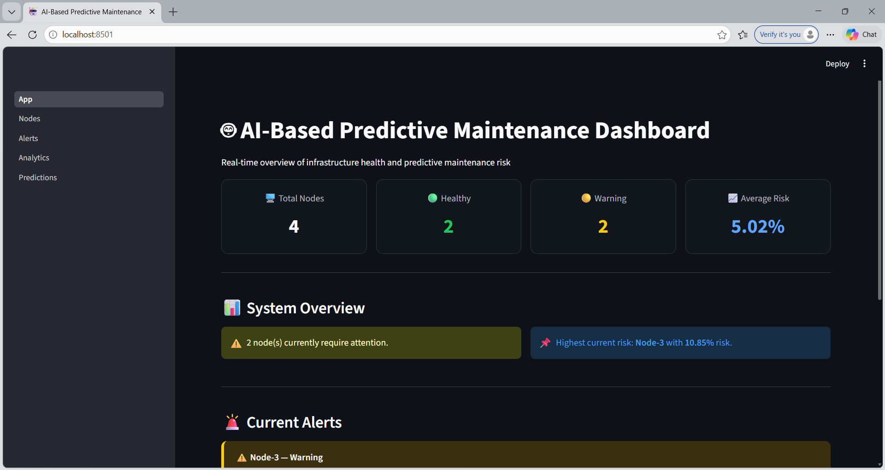
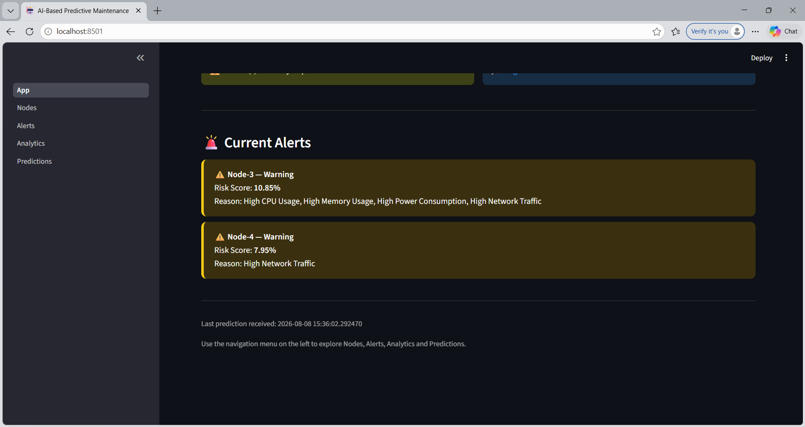
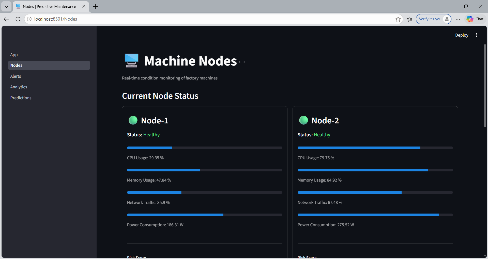
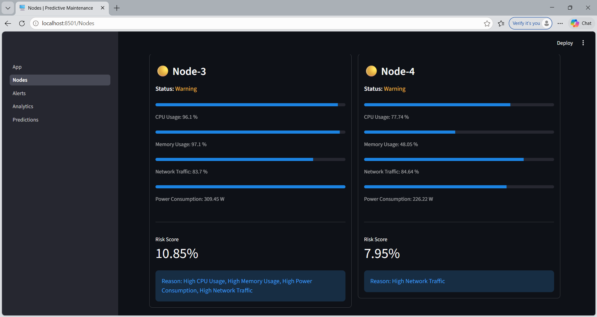
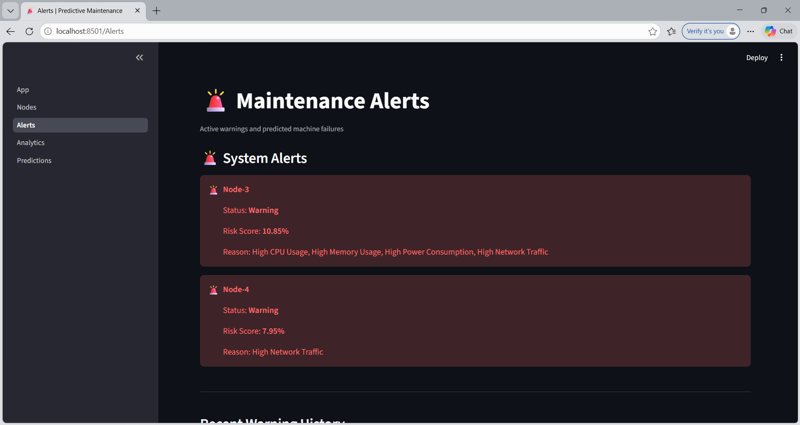
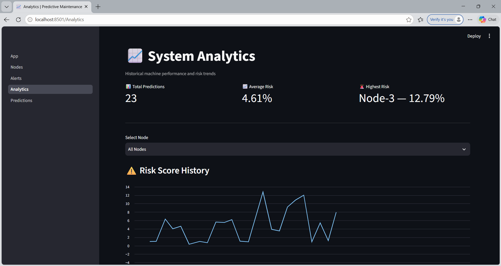
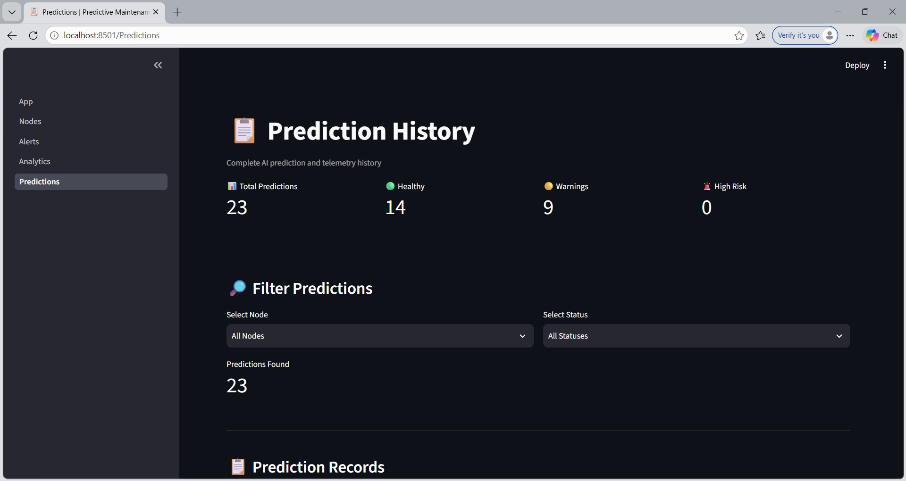
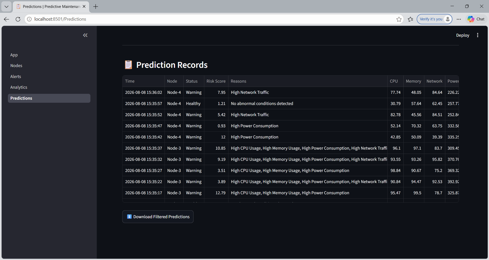

# AI-Based Predictive Maintenance System

An AI-based predictive maintenance system that combines Random Forest and XGBoost with real-time MQTT communication to monitor machine health, detect anomalies, predict failure risks, and visualize machine performance through an interactive Streamlit dashboard.

Developed during my internship at Bharat Electronics Limited (BEL), Ghaziabad (July - August 2026).

## Overview

Machines generate constant telemetry. This project monitors it in real time and predicts which machines are likely to fail, so maintenance can happen before a breakdown.

**Monitored parameters:** CPU usage, memory, network traffic, power consumption, and workload.

## Features

- Anomaly and failure-risk prediction from machine telemetry
- Unified **0-100% risk score** from a probability-based ensemble of Random Forest and XGBoost
- Machines classified as **Healthy**, **Warning**, or **Failure Likely**
- Real-time telemetry pipeline using **MQTT / Mosquitto**
- Multi-page **Streamlit** dashboard with:
  - Node status
  - Maintenance alerts
  - Historical risk and telemetry analytics
  - Prediction history

## Results

| Model | Test Accuracy |
|---|---|
| Random Forest | 76.17% |
| XGBoost | 93.75% |

The final risk score combines the probability outputs of both models.

## Tech Stack

Python, Scikit-learn, XGBoost, SMOTE (class imbalance handling), StandardScaler, Pandas, NumPy, MQTT / Mosquitto, Streamlit

## Project Structure

```
├── App.py            # Streamlit app entry point
├── pages/            # Dashboard pages
├── dashboard/        # Dashboard components
├── src/              # Core source code
├── models/           # Trained models
├── mqtt/             # MQTT communication
├── monitoring/       # Real-time monitoring
├── reports/          # Reports and results
└── requirements.txt  # Python dependencies
```

## How to Run

1. **Clone the repository**
   ```bash
   git clone https://github.com/Smriti2552/AI-Based-Predictive-Maintenance-System.git
   cd AI-Based-Predictive-Maintenance-System
   ```

2. **Install dependencies**
   ```bash
   pip install -r requirements.txt
   ```

3. **Start the Mosquitto MQTT broker** (install Mosquitto first if you don't have it)

4. **Run the dashboard**
   ```bash
   streamlit run App.py
   ```

## Screenshots

### Dashboard Overview



### Machine Nodes



### Maintenance Alerts


### System Analytics


### Prediction History



## Note on Data

The dataset used during the internship is not included in this repository.

## Author

**Smriti Thakur**
B.Tech in AI and Data Science, Guru Gobind Singh Indraprastha University
[LinkedIn](https://www.linkedin.com/in/smritithakur)
